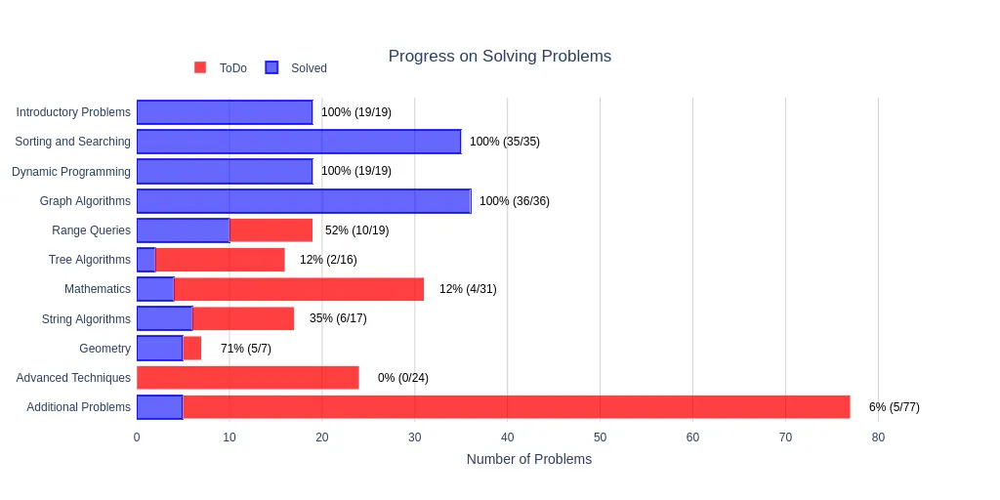

# CSES Solutions

Accepted solutions to the [CSES Problem Set](https://cses.fi/problemset/), written in C++ by [hikjik](https://cses.fi/problemset/user/147386/).



## Generate problem template

```bash
python3 gen_task.py "Weird Algorithm" --tests 2

# Open in Visual Studio Code
code solutions/weird-algorithm/main.cpp
```

## Test solution

```bash
./scripts/grader.sh solutions/weird-algorithm/main.cpp
```

## Problem Set

<details>
<summary>Introductory Problems</summary>

### Introductory Problems

| №   | Name                                                          | Solution                                                                    |Tags|
| --- | ------------------------------------------------------------- | --------------------------------------------------------------------------- |-|
|  1. | [Weird Algorithm](https://cses.fi/problemset/task/1068)       | [weird-algorithm/main.cpp](/solutions/weird-algorithm/main.cpp)             ||
|  2. | [Missing Number](https://cses.fi/problemset/task/1083)        | [missing-number/main.cpp](/solutions/missing-number/main.cpp)               ||
|  3. | [Repetitions](https://cses.fi/problemset/task/1069)           | [repetitions/main.cpp](/solutions/repetitions/main.cpp)                     ||
|  4. | [Increasing Array](https://cses.fi/problemset/task/1094)      | [increasing-array/main.cpp](/solutions/increasing-array/main.cpp)           ||
|  5. | [Permutations](https://cses.fi/problemset/task/1070)          | [permutations/main.cpp](/solutions/permutations/main.cpp)                   ||
|  6. | [Number Spiral](https://cses.fi/problemset/task/1071)         | [number-spiral/main.cpp](/solutions/number-spiral/main.cpp)                 ||
|  7. | [Two Knights](https://cses.fi/problemset/task/1072)           | [two-knights/main.cpp](/solutions/two-knights/main.cpp)                     ||
|  8. | [Two Sets](https://cses.fi/problemset/task/1092)              | [two-sets/main.cpp](/solutions/two-sets/main.cpp)                           ||
|  9. | [Bit Strings](https://cses.fi/problemset/task/1617)           | [bit-strings/main.cpp](/solutions/bit-strings/main.cpp)                     ||
| 10. | [Trailing Zeros](https://cses.fi/problemset/task/1618)        | [trailing-zeros/main.cpp](/solutions/trailing-zeros/main.cpp)               ||
| 11. | [Coin Piles](https://cses.fi/problemset/task/1754)            | [coin-piles/main.cpp](/solutions/coin-piles/main.cpp)                       ||
| 12. | [Palindrome Reorder](https://cses.fi/problemset/task/1755)    | [palindrome-reorder/main.cpp](/solutions/palindrome-reorder/main.cpp)       ||
| 13. | [Gray Code](https://cses.fi/problemset/task/2205)             | [gray-code/main.cpp](/solutions/gray-code/main.cpp)                         ||
| 14. | [Tower of Hanoi](https://cses.fi/problemset/task/2165)        | [tower-of-hanoi/main.cpp](/solutions/tower-of-hanoi/main.cpp)               ||
| 15. | [Creating Strings](https://cses.fi/problemset/task/1622)      | [creating-strings/main.cpp](/solutions/creating-strings/main.cpp)           ||
| 16. | [Apple Division](https://cses.fi/problemset/task/1623)        | [apple-division/main.cpp](/solutions/apple-division/main.cpp)               ||
| 17. | [Chessboard and Queens](https://cses.fi/problemset/task/1624) | [chessboard-and-queens/main.cpp](/solutions/chessboard-and-queens/main.cpp) ||
| 18. | [Digit Queries](https://cses.fi/problemset/task/2431)         | [digit-queries/main.cpp](/solutions/digit-queries/main.cpp)                 ||
| 19. | [Grid Paths](https://cses.fi/problemset/task/1625)            | [grid-paths/main.cpp](/solutions/grid-paths/main.cpp)                       ||

</details>

<details>
<summary>Sorting and Searching</summary>

### Sorting and Searching

| №   | Name                                                             | Solution                                                                          |Tags|
| --- | ---------------------------------------------------------------- | --------------------------------------------------------------------------------- |-|
| 20. | [Distinct Numbers](https://cses.fi/problemset/task/1621)         | [distinct-numbers/main.cpp](/solutions/distinct-numbers/main.cpp)                 ||
| 21. | [Apartments](https://cses.fi/problemset/task/1084)               | [apartments/main.cpp](/solutions/apartments/main.cpp)                             ||
| 22. | [Ferris Wheel](https://cses.fi/problemset/task/1090)             | [ferris-wheel/main.cpp](/solutions/ferris-wheel/main.cpp)                         ||
| 23. | [Concert Tickets](https://cses.fi/problemset/task/1091)          | [concert-tickets/main.cpp](/solutions/concert-tickets/main.cpp)                   ||
| 24. | [Restaurant Customers](https://cses.fi/problemset/task/1619)     | [restaurant-customers/main.cpp](/solutions/restaurant-customers/main.cpp)         ||
| 25. | [Movie Festival](https://cses.fi/problemset/task/1629)           | [movie-festival/main.cpp](/solutions/movie-festival/main.cpp)                     ||
| 26. | [Sum of Two Values](https://cses.fi/problemset/task/1640)        | [sum-of-two-values/main.cpp](/solutions/sum-of-two-values/main.cpp)               ||
| 27. | [Maximum Subarray Sum](https://cses.fi/problemset/task/1643)     | [maximum-subarray-sum/main.cpp](/solutions/maximum-subarray-sum/main.cpp)         ||
| 28. | [Stick Lengths](https://cses.fi/problemset/task/1074)            | [stick-lengths/main.cpp](/solutions/stick-lengths/main.cpp)                       ||
| 29. | [Missing Coin Sum](https://cses.fi/problemset/task/2183)         | [missing-coin-sum/main.cpp](/solutions/missing-coin-sum/main.cpp)                 ||
| 30. | [Collecting Numbers](https://cses.fi/problemset/task/2216)       | [collecting-numbers/main.cpp](/solutions/collecting-numbers/main.cpp)             ||
| 31. | [Collecting Numbers II](https://cses.fi/problemset/task/2217)    | [collecting-numbers-ii/main.cpp](/solutions/collecting-numbers-ii/main.cpp)       ||
| 32. | [Playlist](https://cses.fi/problemset/task/1141)                 | [playlist/main.cpp](/solutions/playlist/main.cpp)                                 ||
| 33. | [Towers](https://cses.fi/problemset/task/1073)                   | [towers/main.cpp](/solutions/towers/main.cpp)                                     ||
| 34. | [Traffic Lights](https://cses.fi/problemset/task/1163)           | [traffic-lights/main.cpp](/solutions/traffic-lights/main.cpp)                     ||
| 35. | [Josephus Problem I](https://cses.fi/problemset/task/2162)       | [josephus-problem-i/main.cpp](/solutions/josephus-problem-i/main.cpp)             ||
| 36. | [Josephus Problem II](https://cses.fi/problemset/task/2163)      | [josephus-problem-ii/main.cpp](/solutions/josephus-problem-ii/main.cpp)           ||
| 37. | [Nested Ranges Check](https://cses.fi/problemset/task/2168)      | [nested-ranges-check/main.cpp](/solutions/nested-ranges-check/main.cpp)           ||
| 38. | [Nested Ranges Count](https://cses.fi/problemset/task/2169)      | [nested-ranges-count/main.cpp](/solutions/nested-ranges-count/main.cpp)           ||
| 39. | [Room Allocation](https://cses.fi/problemset/task/1164)          | [room-allocation/main.cpp](/solutions/room-allocation/main.cpp)                   ||
| 40. | [Factory Machines](https://cses.fi/problemset/task/1620)         | [factory-machines/main.cpp](/solutions/factory-machines/main.cpp)                 ||
| 41. | [Tasks and Deadlines](https://cses.fi/problemset/task/1630)      | [tasks-and-deadlines/main.cpp](/solutions/tasks-and-deadlines/main.cpp)           ||
| 42. | [Reading Books](https://cses.fi/problemset/task/1631)            | [reading-books/main.cpp](/solutions/reading-books/main.cpp)                       ||
| 43. | [Sum of Three Values](https://cses.fi/problemset/task/1641)      | [sum-of-three-values/main.cpp](/solutions/sum-of-three-values/main.cpp)           ||
| 44. | [Sum of Four Values](https://cses.fi/problemset/task/1642)       | [sum-of-four-values/main.cpp](/solutions/sum-of-four-values/main.cpp)             ||
| 45. | [Nearest Smaller Values](https://cses.fi/problemset/task/1645)   | [nearest-smaller-values/main.cpp](/solutions/nearest-smaller-values/main.cpp)     ||
| 46. | [Subarray Sums I](https://cses.fi/problemset/task/1660)          | [subarray-sums-i/main.cpp](/solutions/subarray-sums-i/main.cpp)                   ||
| 47. | [Subarray Sums II](https://cses.fi/problemset/task/1661)         | [subarray-sums-ii/main.cpp](/solutions/subarray-sums-ii/main.cpp)                 ||
| 48. | [Subarray Divisibility](https://cses.fi/problemset/task/1662)    | [subarray-divisibility/main.cpp](/solutions/subarray-divisibility/main.cpp)       ||
| 49. | [Subarray Distinct Values](https://cses.fi/problemset/task/2428) | [subarray-distinct-values/main.cpp](/solutions/subarray-distinct-values/main.cpp) ||
| 50. | [Array Division](https://cses.fi/problemset/task/1085)           | [array-division/main.cpp](/solutions/array-division/main.cpp)                     ||
| 51. | [Sliding Median](https://cses.fi/problemset/task/1076)           | [sliding-median/main.cpp](/solutions/sliding-median/main.cpp)                     ||
| 52. | [Sliding Cost](https://cses.fi/problemset/task/1077)             | [sliding-cost/main.cpp](/solutions/sliding-cost/main.cpp)                         ||
| 53. | [Movie Festival II](https://cses.fi/problemset/task/1632)        | [movie-festival-ii/main.cpp](/solutions/movie-festival-ii/main.cpp)               ||
| 54. | [Maximum Subarray Sum II](https://cses.fi/problemset/task/1644)  | [maximum-subarray-sum-ii/main.cpp](/solutions/maximum-subarray-sum-ii/main.cpp)   ||

</details>

<details>
<summary>Dynamic Programming</summary>

### Dynamic Programming

| №   | Name                                                           | Solution                                                                      |Tags|
| --- | -------------------------------------------------------------- | ----------------------------------------------------------------------------- |-|
| 55. | [Dice Combinations](https://cses.fi/problemset/task/1633/)     | [dice-combinations/main.cpp](/solutions/dice-combinations/main.cpp)           ||
| 56. | [Minimizing Coins](https://cses.fi/problemset/task/1634)       | [minimizing-coins/main.cpp](/solutions/minimizing-coins/main.cpp)             ||
| 57. | [Coin Combinations I](https://cses.fi/problemset/task/1635)    | [coin-combinations-i/main.cpp](/solutions/coin-combinations-i/main.cpp)       ||
| 58. | [Coin Combinations II](https://cses.fi/problemset/task/1636)   | [coin-combinations-ii/main.cpp](/solutions/coin-combinations-ii/main.cpp)     ||
| 59. | [Removing Digits](https://cses.fi/problemset/task/1637)        | [removing-digits/main.cpp](/solutions/removing-digits/main.cpp)               ||
| 60. | [Grid Paths](https://cses.fi/problemset/task/1638)             | [grid-paths-ii/main.cpp](/solutions/grid-paths-ii/main.cpp)                   ||
| 61. | [Book Shop](https://cses.fi/problemset/task/1158)              | [book-shop/main.cpp](/solutions/book-shop/main.cpp)                           ||
| 62. | [Array Description](https://cses.fi/problemset/task/1746)      | [array-description/main.cpp](/solutions/array-description/main.cpp)           ||
| 63. | [Counting Towers](https://cses.fi/problemset/task/2413)        | [counting-towers/main.cpp](/solutions/counting-towers/main.cpp)               ||
| 64. | [Edit Distance](https://cses.fi/problemset/task/1639)          | [edit-distance/main.cpp](/solutions/edit-distance/main.cpp)                   ||
| 65. | [Rectangle Cutting](https://cses.fi/problemset/task/1744)      | [rectangle-cutting/main.cpp](/solutions/rectangle-cutting/main.cpp)           ||
| 66. | [Money Sums](https://cses.fi/problemset/task/1745)             | [money-sums/main.cpp](/solutions/money-sums/main.cpp)                         ||
| 67. | [Removal Game](https://cses.fi/problemset/task/1097)           | [removal-game/main.cpp](/solutions/removal-game/main.cpp)                     ||
| 68. | [Two Sets II](https://cses.fi/problemset/task/1093)            | [two-sets-ii/main.cpp](/solutions/two-sets-ii/main.cpp)                       ||
| 69. | [Increasing Subsequence](https://cses.fi/problemset/task/1145) | [increasing-subsequence/main.cpp](/solutions/increasing-subsequence/main.cpp) ||
| 70. | [Projects](https://cses.fi/problemset/task/1140)               | [projects/main.cpp](/solutions/projects/main.cpp)                             ||
| 71. | [Elevator Rides](https://cses.fi/problemset/task/1653)         | [elevator-rides/main.cpp](/solutions/elevator-rides/main.cpp)                 ||
| 72. | [Counting Tilings](https://cses.fi/problemset/task/2181)       | [counting-tilings/main.cpp](/solutions/counting-tilings/main.cpp)             ||
| 73. | [Counting Numbers](https://cses.fi/problemset/task/2220)       | [counting-numbers/main.cpp](/solutions/counting-numbers/main.cpp)             ||

</details>

<details>
<summary>Graph Algorithms</summary>

### Graph Algorithms

| №    | Name                                                          | Solution                                                                  | Tags                                                                                     |
| ---- | ------------------------------------------------------------- | ------------------------------------------------------------------------- | :--------------------------------------------------------------------------------------- |
|  74. | [Counting Rooms](https://cses.fi/problemset/task/1192/)       | [counting-rooms/main.cpp](/solutions/counting-rooms/main.cpp)             | DFS on a Grid<br/>Flood Fill<br/>Count Connected Components                              |
|  75. | [Labyrinth](https://cses.fi/problemset/task/1193/)            | [labyrinth/main.cpp](/solutions/labyrinth/main.cpp)                       | BFS on a Grid<br/>Shortest Path (by number of edges)                                     |
|  76. | [Building Roads](https://cses.fi/problemset/task/1666/)       | [building-roads/main.cpp](/solutions/building-roads/main.cpp)             | DFS for Undirected Graph<br/>Min Number of Edges to Connect Graph                        |
|  77. | [Message Route](https://cses.fi/problemset/task/1667/)        | [message-route/main.cpp](/solutions/message-route/main.cpp)               | BFS for Undirected Graph<br/>Shortest Path (by number of edges)                          |
|  78. | [Building Teams](https://cses.fi/problemset/task/1668/)       | [building-teams/main.cpp](/solutions/building-teams/main.cpp)             | BFS for Undirected Graph<br/>Bipartite graph                                             |
|  79. | [Round Trip](https://cses.fi/problemset/task/1669/)           | [round-trip/main.cpp](/solutions/round-trip/main.cpp)                     | DFS for Undirected Graph<br/>Cycle Retrieval                                             |
|  80. | [Monsters](https://cses.fi/problemset/task/1194/)             | [monsters/main.cpp](/solutions/monsters/main.cpp)                         | Multi Source BFS on a Grid                                                               |
|  81. | [Shortest Routes I](https://cses.fi/problemset/task/1671/)    | [shortest-routes-i/main.cpp](/solutions/shortest-routes-i/main.cpp)       | Shortest Paths in a Directed Graph<br/>Dijkstra’s Algorithm                              |
|  82. | [Shortest Routes II](https://cses.fi/problemset/task/1672/)   | [shortest-routes-ii/main.cpp](/solutions/shortest-routes-ii/main.cpp)     | All-Pairs Shortest Paths in an Undirected Graph<br/>Floyd Warshall Algorithm             |
|  83. | [High Score](https://cses.fi/problemset/task/1673/)           | [high-score/main.cpp](/solutions/high-score/main.cpp)                     | Shortest Paths in a Directed Graph<br/>Negative weight edges</br> Bellman Ford Algorithm |
|  84. | [Flight Discount](https://cses.fi/problemset/task/1195/)      | [flight-discount/main.cpp](/solutions/flight-discount/main.cpp)           | Shortest Paths in a Directed Graph<br/>Modified Dijkstra’s Algorithm                     |
|  85. | [Cycle Finding](https://cses.fi/problemset/task/1197/)        | [cycle-finding/main.cpp](/solutions/cycle-finding/main.cpp)               | Retrieve Negative Cycle in a Directed Graph<br/>Bellman-Ford Algorithm                   |
|  86. | [Flight Routes](https://cses.fi/problemset/task/1196/)        | [flight-routes/main.cpp](/solutions/flight-routes/main.cpp)               | K-Shortest Paths in a Directed Graph<br/>Modified Dijkstra’s Algorithm                   |
|  87. | [Round Trip II](https://cses.fi/problemset/task/1678/)        | [round-trip-ii/main.cpp](/solutions/round-trip-ii/main.cpp)               | DFS for Directed Graph<br/>Cycle Retrieval                                               |
|  88. | [Course Schedule](https://cses.fi/problemset/task/1679/)      | [course-schedule/main.cpp](/solutions/course-schedule/main.cpp)           | Topological Sort<br/>Kahn's Algorithm                                                    |
|  89. | [Longest Flight Route](https://cses.fi/problemset/task/1680/) | [longest-flight-route/main.cpp](/solutions/longest-flight-route/main.cpp) | Topological Sort<br/>Kahn's Algorithm<br/>Dynamic Programming                            |
|  90. | [Game Routes](https://cses.fi/problemset/task/1681/)          | [game-routes/main.cpp](/solutions/game-routes/main.cpp)                   | Topological Sort<br/>Kahn's Algorithm<br/>Dynamic programming                            |
|  91. | [Investigation](https://cses.fi/problemset/task/1202/)        | [investigation/main.cpp](/solutions/investigation/main.cpp)               | Shortest Paths in a Directed Graph<br/>Modified Dijkstra’s Algorithm                     |
|  92. | [Planets Queries I](https://cses.fi/problemset/task/1750/)    | [planets-queries-i/main.cpp](/solutions/planets-queries-i/main.cpp)       | Functional Graph                                                                         |
|  93. | [Planets Queries II](https://cses.fi/problemset/task/1160/)   | [planets-queries-ii/main.cpp](/solutions/planets-queries-ii/main.cpp)     | Functional Graph<br/>DFS for Directed Graph                                              |
|  94. | [Planets Cycles](https://cses.fi/problemset/task/1751/)       | [planets-cycles/main.cpp](/solutions/planets-cycles/main.cpp)             | Functional Graph<br/>DFS for Directed Graph                                              |
|  95. | [Road Reparation](https://cses.fi/problemset/task/1675/)      | [road-reparation/main.cpp](/solutions/road-reparation/main.cpp)           | Disjoint Sets Union                                                                      |
|  96. | [Road Construction](https://cses.fi/problemset/task/1676/)    | [road-construction/main.cpp](/solutions/road-construction/main.cpp)       | Disjoint Sets Union                                                                      |
|  97. | [Flight Routes Check](https://cses.fi/problemset/task/1682/)  | [flight-routes-check/main.cpp](/solutions/flight-routes-check/main.cpp)   | DFS for Directed Graph<br/>Check if a Graph is Strongly Connected                        |
|  98. | [Planets and Kingdoms](https://cses.fi/problemset/task/1683/) | [planets-and-kingdoms/main.cpp](/solutions/planets-and-kingdoms/main.cpp) | Strongly Connected Component<br/>Kosaraju's algorithm                                    |
|  99. | [Giant Pizza](https://cses.fi/problemset/task/1684/)          | [giant-pizza/main.cpp](/solutions/giant-pizza/main.cpp)                   | Strongly Connected Component<br/>Kosaraju's algorithm<br/>Topological Sort               |
| 100. | [Coin Collector](https://cses.fi/problemset/task/1686/)       | [coin-collector/main.cpp](/solutions/coin-collector/main.cpp)             | Strongly Connected Component<br/>Kosaraju's algorithm<br/>Condensation graph             |
| 101. | [Mail Delivery](https://cses.fi/problemset/task/1691/)        | [mail-delivery/main.cpp](/solutions/mail-delivery/main.cpp)               | Eulerian Circuit                                                                         |
| 102. | [De Bruijn Sequence](https://cses.fi/problemset/task/1692/)   | [de-bruijn-sequence/main.cpp](/solutions/de-bruijn-sequence/main.cpp)     | Eulerian Circuit                                                                         |
| 103. | [Teleporters Path](https://cses.fi/problemset/task/1693/)     | [teleporters-path/main.cpp](/solutions/teleporters-path/main.cpp)         | Eulerian Path                                                                            |
| 104. | [Hamiltonian Flights](https://cses.fi/problemset/task/1690/)  | [hamiltonian-flights/main.cpp](/solutions/hamiltonian-flights/main.cpp)   | Hamiltonian Path<br/>Bitmasking and Dynamic Programming                                  |
| 105. | [Knight's Tour](https://cses.fi/problemset/task/1689/)        | [knights-tour/main.cpp](/solutions/knights-tour/main.cpp)                 | Hamiltonian Path<br/>Backtracking with Warnsdorff's heuristic                            |
| 106. | [Download Speed](https://cses.fi/problemset/task/1694/)       | [download-speed/main.cpp](/solutions/download-speed/main.cpp)             | Max Flow</br>Edmonds Karp Algorithm                                                      |
| 107. | [Police Chase](https://cses.fi/problemset/task/1695/)         | [police-chase/main.cpp](/solutions/police-chase/main.cpp)                 | Max Flow</br>Minimum Cut</br>Edmonds Karp Algorithm                                      |
| 108. | [School Dance](https://cses.fi/problemset/task/1696/)         | [school-dance/main.cpp](/solutions/school-dance/main.cpp)                 | Max Flow</br>Bipartite Matching</br>Edmonds Karp Algorithm                               |
| 109. | [Distinct Routes](https://cses.fi/problemset/task/1711/)      | [distinct-routes/main.cpp](/solutions/distinct-routes/main.cpp)           | Max Flow</br>Edge Disjoint Paths</br>Edmonds Karp Algorithm                              |

</details>

<details>
<summary>Range Queries</summary>

### Range Queries

| №    | Name                                                                  | Solution                                                                                    | Tags          |
| ---- | --------------------------------------------------------------------- | ------------------------------------------------------------------------------------------- | :------------ |
| 110. | [Static Range Sum Queries](https://cses.fi/problemset/task/1646)      | [static-range-sum-queries/main.cpp](/solutions/static-range-sum-queries/main.cpp)           | Prefix Sum    |
| 111. | [Static Range Minimum Queries](https://cses.fi/problemset/task/1647)  | [static-range-minimum-queries/main.cpp](/solutions/static-range-minimum-queries/main.cpp)   | Sparse Table  |
| 112. | [Dynamic Range Sum Queries](https://cses.fi/problemset/task/1648)     | [dynamic-range-sum-queries/main.cpp](/solutions/dynamic-range-sum-queries/main.cpp)         | Fenwick Tree  |
| 113. | [Dynamic Range Minimum Queries](https://cses.fi/problemset/task/1649) | [dynamic-range-minimum-queries/main.cpp](/solutions/dynamic-range-minimum-queries/main.cpp) | Segment Tree  |
| 114. | [Range Xor Queries](https://cses.fi/problemset/task/1650)             | [range-xor-queries/main.cpp](/solutions/range-xor-queries/main.cpp)                         | Prefix Sum    |
| 115. | [Range Update Queries](https://cses.fi/problemset/task/1651)          | [range-update-queries/main.cpp](/solutions/range-update-queries/main.cpp)                   | Segment Tree  |
| 116. | [Forest Queries](https://cses.fi/problemset/task/1652)                | [forest-queries/main.cpp](/solutions/forest-queries/main.cpp)                               | Prefix Sum 2D |
| 117. | [Hotel Queries](https://cses.fi/problemset/task/1143)                 | [hotel-queries/main.cpp](/solutions/hotel-queries/main.cpp)                                 | Segment Tree  |
| 118. | [List Removals](https://cses.fi/problemset/task/1749)                 | [list-removals/main.cpp](/solutions/list-removals/main.cpp)                                 | Ordered Set   |
| 119. | [Salary Queries](https://cses.fi/problemset/task/1144)                | ||
| 120. | [Prefix Sum Queries](https://cses.fi/problemset/task/2166)            | ||
| 121. | [Pizzeria Queries](https://cses.fi/problemset/task/2206)              | ||
| 122. | [Subarray Sum Queries](https://cses.fi/problemset/task/1190)          | ||
| 123. | [Distinct Values Queries](https://cses.fi/problemset/task/1734)       | ||
| 124. | [Increasing Array Queries](https://cses.fi/problemset/task/2416)      | ||
| 125. | [Forest Queries II](https://cses.fi/problemset/task/1739)             | ||
| 126. | [Range Updates and Sums](https://cses.fi/problemset/task/1735)        | ||
| 127. | [Polynomial Queries](https://cses.fi/problemset/task/1736)            | ||
| 128. | [Range Queries and Copies](https://cses.fi/problemset/task/1737)      | ||

</details>

<details>
<summary>Tree Algorithms</summary>

### Tree Algorithms

| №    | Name                                                          | Solution                                                  | Tags |
| ---- | ------------------------------------------------------------- | --------------------------------------------------------- |-|
| 129. | [Subordinates](https://cses.fi/problemset/task/1674)          | [subordinates/main.cpp](/solutions/subordinates/main.cpp) ||
| 130. | [Tree Matching](https://cses.fi/problemset/task/1130)         |||
| 131. | [Tree Diameter](https://cses.fi/problemset/task/1131)         |||
| 132. | [Tree Distances I](https://cses.fi/problemset/task/1132)      |||
| 133. | [Tree Distances II](https://cses.fi/problemset/task/1133)     |||
| 134. | [Company Queries I](https://cses.fi/problemset/task/1687)     |||
| 135. | [Company Queries II](https://cses.fi/problemset/task/1688)    |||
| 136. | [Distance Queries](https://cses.fi/problemset/task/1135)      |||
| 137. | [Counting Paths](https://cses.fi/problemset/task/1136)        |||
| 138. | [Subtree Queries](https://cses.fi/problemset/task/1137)       |||
| 139. | [Path Queries](https://cses.fi/problemset/task/1138)          |||
| 140. | [Path Queries II](https://cses.fi/problemset/task/2134)       |||
| 141. | [Distinct Colors](https://cses.fi/problemset/task/1139)       |||
| 142. | [Finding a Centroid](https://cses.fi/problemset/task/2079)    |||
| 143. | [Fixed-Length Paths I](https://cses.fi/problemset/task/2080)  |||
| 144. | [Fixed-Length Paths II](https://cses.fi/problemset/task/2081) |||

</details>

<details>
<summary>Mathematics</summary>

### Mathematics

| №    | Name                                                           | Solution                                                            | Tags |
| ---- | -------------------------------------------------------------- | ------------------------------------------------------------------- |-|
| 145. | [Josephus Queries](https://cses.fi/problemset/task/2164)       |||
| 146. | [Exponentiation](https://cses.fi/problemset/task/1095)         | [exponentiation/main.cpp](/solutions/exponentiation/main.cpp)       ||
| 147. | [Exponentiation II](https://cses.fi/problemset/task/1712)      | [exponentiation-ii/main.cpp](/solutions/exponentiation-ii/main.cpp) ||
| 148. | [Counting Divisors](https://cses.fi/problemset/task/1713)      | [counting-divisors/main.cpp](/solutions/counting-divisors/main.cpp) ||
| 149. | [Common Divisors](https://cses.fi/problemset/task/1081)        | [common-divisors/main.cpp](/solutions/common-divisors/main.cpp)     ||
| 150. | [Sum of Divisors](https://cses.fi/problemset/task/1082)        |||
| 151. | [Divisor Analysis](https://cses.fi/problemset/task/2182)       |||
| 152. | [Prime Multiples](https://cses.fi/problemset/task/2185)        |||
| 153. | [Counting Coprime Pairs](https://cses.fi/problemset/task/2417) |||
| 154. | [Binomial Coefficients](https://cses.fi/problemset/task/1079)  |||
| 155. | [Creating Strings II](https://cses.fi/problemset/task/1715)    |||
| 156. | [Distributing Apples](https://cses.fi/problemset/task/1716)    |||
| 157. | [Christmas Party](https://cses.fi/problemset/task/1717)        |||
| 158. | [Bracket Sequences I](https://cses.fi/problemset/task/2064)    |||
| 159. | [Bracket Sequences II](https://cses.fi/problemset/task/2187)   |||
| 160. | [Counting Necklaces](https://cses.fi/problemset/task/2209)     |||
| 161. | [Counting Grids](https://cses.fi/problemset/task/2210)         |||
| 162. | [Fibonacci Numbers](https://cses.fi/problemset/task/1722)      |||
| 163. | [Throwing Dice](https://cses.fi/problemset/task/1096)          |||
| 164. | [Graph Paths I](https://cses.fi/problemset/task/1723)          |||
| 165. | [Graph Paths II](https://cses.fi/problemset/task/1724)         |||
| 166. | [Dice Probability](https://cses.fi/problemset/task/1725)       |||
| 167. | [Moving Robots](https://cses.fi/problemset/task/1726)          |||
| 168. | [Candy Lottery](https://cses.fi/problemset/task/1727)          |||
| 169. | [Inversion Probability](https://cses.fi/problemset/task/1728)  |||
| 170. | [Stick Game](https://cses.fi/problemset/task/1729)             |||
| 171. | [Nim Game I](https://cses.fi/problemset/task/1730)             |||
| 172. | [Nim Game II](https://cses.fi/problemset/task/1098)            |||
| 173. | [Stair Game](https://cses.fi/problemset/task/1099)             |||
| 174. | [Grundy's Game](https://cses.fi/problemset/task/2207)          |||
| 175. | [Another Game](https://cses.fi/problemset/task/2208)           |||

</details>

<details>
<summary>String Algorithms</summary>

### String Algorithms

| №    | Name                                                           | Solution | Tags |
| ---- | -------------------------------------------------------------- | -------- |-|
| 176. | [Word Combinations](https://cses.fi/problemset/task/1731)      |||
| 177. | [String Matching](https://cses.fi/problemset/task/1753)        |||
| 178. | [Finding Borders](https://cses.fi/problemset/task/1732)        |||
| 179. | [Finding Periods](https://cses.fi/problemset/task/1733)        |||
| 180. | [Minimal Rotation](https://cses.fi/problemset/task/1110)       |||
| 181. | [Longest Palindrome](https://cses.fi/problemset/task/1111)     |||
| 182. | [Required Substring](https://cses.fi/problemset/task/1112)     |||
| 183. | [Palindrome Queries](https://cses.fi/problemset/task/2420)     |||
| 184. | [Finding Patterns](https://cses.fi/problemset/task/2102)       |||
| 185. | [Counting Patterns](https://cses.fi/problemset/task/2103)      |||
| 186. | [Pattern Positions](https://cses.fi/problemset/task/2104)      |||
| 187. | [Distinct Substrings](https://cses.fi/problemset/task/2105)    |||
| 188. | [Repeating Substring](https://cses.fi/problemset/task/2106)    |||
| 189. | [String Functions](https://cses.fi/problemset/task/2107)       |||
| 190. | [Substring Order I](https://cses.fi/problemset/task/2108)      |||
| 191. | [Substring Order II](https://cses.fi/problemset/task/2109)     |||
| 192. | [Substring Distribution](https://cses.fi/problemset/task/2110) |||

</details>

<details>
<summary>Geometry</summary>

### Geometry

| №    | Name                                                               | Solution                                                                            | Tags |
| ---- | ------------------------------------------------------------------ | ----------------------------------------------------------------------------------- |-|
| 193. | [Point Location Test](https://cses.fi/problemset/task/2189)        | [point-location-test/main.cpp](/solutions/point-location-test/main.cpp)             ||
| 194. | [Line Segment Intersection](https://cses.fi/problemset/task/2190)  | [line-segment-intersection/main.cpp](/solutions/line-segment-intersection/main.cpp) ||
| 195. | [Polygon Area](https://cses.fi/problemset/task/2191)               | [polygon-area/main.cpp](/solutions/polygon-area/main.cpp)                           ||
| 196. | [Point in Polygon](https://cses.fi/problemset/task/2192)           | [point-in-polygon/main.cpp](/solutions/point-in-polygon/main.cpp)                   ||
| 197. | [Polygon Lattice Points](https://cses.fi/problemset/task/2193)     | [polygon-lattice-points/main.cpp](/solutions/polygon-lattice-points/main.cpp)       ||
| 198. | [Minimum Euclidean Distance](https://cses.fi/problemset/task/2194) |||
| 199. | [Convex Hull](https://cses.fi/problemset/task/2195)                |||

</details>

<details>
<summary>Advanced Techniques</summary>

### Advanced Techniques

| №    | Name                                                         | Solution | Tags |
| ---- | ------------------------------------------------------------ | -------- |-|
| 200. | [Meet in the Middle](https://cses.fi/problemset/task/1628)   |||
| 201. | [Hamming Distance](https://cses.fi/problemset/task/2136)     |||
| 202. | [Beautiful Subgrids](https://cses.fi/problemset/task/2137)   |||
| 203. | [Reachable Nodes](https://cses.fi/problemset/task/2138)      |||
| 204. | [Reachability Queries](https://cses.fi/problemset/task/2143) |||
| 205. | [Cut and Paste](https://cses.fi/problemset/task/2072)        |||
| 206. | [Substring Reversals](https://cses.fi/problemset/task/2073)  |||
| 207. | [Reversals and Sums](https://cses.fi/problemset/task/2074)   |||
| 208. | [Necessary Roads](https://cses.fi/problemset/task/2076)      |||
| 209. | [Necessary Cities](https://cses.fi/problemset/task/2077)     |||
| 210. | [Eulerian Subgraphs](https://cses.fi/problemset/task/2078)   |||
| 211. | [Monster Game I](https://cses.fi/problemset/task/2084)       |||
| 212. | [Monster Game II](https://cses.fi/problemset/task/2085)      |||
| 213. | [Subarray Squares](https://cses.fi/problemset/task/2086)     |||
| 214. | [Houses and Schools](https://cses.fi/problemset/task/2087)   |||
| 215. | [Knuth Division](https://cses.fi/problemset/task/2088)       |||
| 216. | [Apples and Bananas](https://cses.fi/problemset/task/2111)   |||
| 217. | [One Bit Positions](https://cses.fi/problemset/task/2112)    |||
| 218. | [Signal Processing](https://cses.fi/problemset/task/2113)    |||
| 219. | [New Roads Queries](https://cses.fi/problemset/task/2101)    |||
| 220. | [Dynamic Connectivity](https://cses.fi/problemset/task/2133) |||
| 221. | [Parcel Delivery](https://cses.fi/problemset/task/2121)      |||
| 222. | [Task Assignment](https://cses.fi/problemset/task/2129)      |||
| 223. | [Distinct Routes II](https://cses.fi/problemset/task/2130)   |||

</details>

<details>
<summary>Additional Problems</summary>

### Additional Problems

| №    | Name                                                                  | Solution                                                                  | Tags |
| ---- | --------------------------------------------------------------------- | ------------------------------------------------------------------------- |-|
| 224. | [Shortest Subsequence](https://cses.fi/problemset/task/1087)          |                                                                           ||
| 225. | [Counting Bits](https://cses.fi/problemset/task/1146)                 |                                                                           ||
| 226. | [Swap Game](https://cses.fi/problemset/task/1670)                     | [swap-game/main.cpp](/solutions/swap-game/main.cpp)                       ||
| 227. | [Prüfer Code](https://cses.fi/problemset/task/1134)                   | [prufer-code/main.cpp](/solutions/prufer-code/main.cpp)                   ||
| 228. | [Acyclic Graph Edges](https://cses.fi/problemset/task/1756)           |                                                                           ||
| 229. | [Strongly Connected Edges](https://cses.fi/problemset/task/2177)      |                                                                           ||
| 230. | [Even Outdegree Edges](https://cses.fi/problemset/task/2179)          |                                                                           ||
| 231. | [Multiplication Table](https://cses.fi/problemset/task/2422)          | [multiplication-table/main.cpp](/solutions/multiplication-table/main.cpp) ||
| 232. | [Advertisement](https://cses.fi/problemset/task/1142)                 |||
| 233. | [Special Substrings](https://cses.fi/problemset/task/2186)            |||
| 234. | [Permutation Inversions](https://cses.fi/problemset/task/2229)        |||
| 235. | [Maximum Xor Subarray](https://cses.fi/problemset/task/1655)          |||
| 236. | [Movie Festival Queries](https://cses.fi/problemset/task/1664)        |||
| 237. | [Chess Tournament](https://cses.fi/problemset/task/1697)              |||
| 238. | [Tree Traversals](https://cses.fi/problemset/task/1702)               |||
| 239. | [Network Renovation](https://cses.fi/problemset/task/1704)            |||
| 240. | [Graph Girth](https://cses.fi/problemset/task/1707)                   |||
| 241. | [Intersection Points](https://cses.fi/problemset/task/1740)           |||
| 242. | [Inverse Inversions](https://cses.fi/problemset/task/2214)            |||
| 243. | [Monotone Subsequences](https://cses.fi/problemset/task/2215)         |||
| 244. | [String Reorder](https://cses.fi/problemset/task/1743)                |||
| 245. | [Stack Weights](https://cses.fi/problemset/task/2425)                 |||
| 246. | [Pyramid Array](https://cses.fi/problemset/task/1747)                 |||
| 247. | [Increasing Subsequence II](https://cses.fi/problemset/task/1748)     |||
| 248. | [String Removals](https://cses.fi/problemset/task/1149)               |||
| 249. | [Bit Inversions](https://cses.fi/problemset/task/1188)                |||
| 250. | [Xor Pyramid](https://cses.fi/problemset/task/2419)                   |||
| 251. | [Writing Numbers](https://cses.fi/problemset/task/1086)               |||
| 252. | [String Transform](https://cses.fi/problemset/task/1113)              |||
| 253. | [Letter Pair Move Game](https://cses.fi/problemset/task/2427)         |||
| 254. | [Maximum Building I](https://cses.fi/problemset/task/1147)            |||
| 255. | [Sorting Methods](https://cses.fi/problemset/task/1162)               |||
| 256. | [Cyclic Array](https://cses.fi/problemset/task/1191)                  |||
| 257. | [List of Sums](https://cses.fi/problemset/task/2414)                  |||
| 258. | [Increasing Array II](https://cses.fi/problemset/task/2132)           |||
| 259. | [Food Division](https://cses.fi/problemset/task/1189)                 |||
| 260. | [Bit Problem](https://cses.fi/problemset/task/1654)                   |||
| 261. | [Swap Round Sorting](https://cses.fi/problemset/task/1698)            |||
| 262. | [Binary Subsequences](https://cses.fi/problemset/task/2430)           |||
| 263. | [Tree Isomorphism I](https://cses.fi/problemset/task/1700)            |||
| 264. | [Counting Sequences](https://cses.fi/problemset/task/2228)            |||
| 265. | [Critical Cities](https://cses.fi/problemset/task/1703)               |||
| 266. | [School Excursion](https://cses.fi/problemset/task/1706)              |||
| 267. | [Coin Grid](https://cses.fi/problemset/task/1709)                     |||
| 268. | [Robot Path](https://cses.fi/problemset/task/1742)                    |||
| 269. | [Programmers and Artists](https://cses.fi/problemset/task/2426)       |||
| 270. | [Course Schedule II](https://cses.fi/problemset/task/1757)            |||
| 271. | [Removing Digits II](https://cses.fi/problemset/task/2174)            |||
| 272. | [Coin Arrangement](https://cses.fi/problemset/task/2180)              |||
| 273. | [Counting Bishops](https://cses.fi/problemset/task/2176)              |||
| 274. | [Grid Puzzle I](https://cses.fi/problemset/task/2432)                 |||
| 275. | [Grid Puzzle II](https://cses.fi/problemset/task/2131)                |||
| 276. | [Empty String](https://cses.fi/problemset/task/1080)                  |||
| 277. | [Grid Paths](https://cses.fi/problemset/task/1078)                    |||
| 278. | [Bit Substrings](https://cses.fi/problemset/task/2115)                |||
| 279. | [Reversal Sorting](https://cses.fi/problemset/task/2075)              |||
| 280. | [Counting Reorders](https://cses.fi/problemset/task/2421)             |||
| 281. | [Book Shop II](https://cses.fi/problemset/task/1159)                  |||
| 282. | [Network Breakdown](https://cses.fi/problemset/task/1677)             |||
| 283. | [Visiting Cities](https://cses.fi/problemset/task/1203)               |||
| 284. | [Missing Coin Sum Queries](https://cses.fi/problemset/task/2184)      |||
| 285. | [Number Grid](https://cses.fi/problemset/task/1157)                   |||
| 286. | [Maximum Building II](https://cses.fi/problemset/task/1148)           |||
| 287. | [Filling Trominos](https://cses.fi/problemset/task/2423)              |||
| 288. | [Stick Divisions](https://cses.fi/problemset/task/1161)               | [stick-divisions/main.cpp](/solutions/stick-divisions/main.cpp)            ||
| 289. | [Coding Company](https://cses.fi/problemset/task/1665)                |||
| 290. | [Flight Route Requests](https://cses.fi/problemset/task/1699)         |||
| 291. | [Two Stacks Sorting](https://cses.fi/problemset/task/2402)            |||
| 292. | [Tree Isomorphism II](https://cses.fi/problemset/task/1701)           |||
| 293. | [Forbidden Cities](https://cses.fi/problemset/task/1705)              |||
| 294. | [Area of Rectangles](https://cses.fi/problemset/task/1741)            |||
| 295. | [Grid Completion](https://cses.fi/problemset/task/2429)               |||
| 296. | [Creating Offices](https://cses.fi/problemset/task/1752)              |||
| 297. | [Permutations II](https://cses.fi/problemset/task/1075)               |||
| 298. | [Functional Graph Distribution](https://cses.fi/problemset/task/2415) |||
| 299. | [New Flight Routes](https://cses.fi/problemset/task/1685)             |||
| 300. | [Grid Path Construction](https://cses.fi/problemset/task/2418)        |||

</details>
